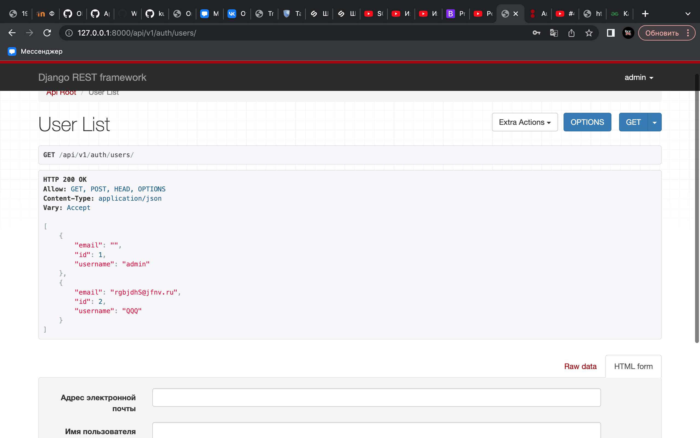

# Знакомство и изучение Django Rest Api Framework

## Техническое задание

Создать пробное веб-приложение с использованием Django REST Framework (DRF) для демонстрации работы с RESTful API и базой данных.

## Результаты работы

Результатом является полностью функционирующее веб-приложение на базе Django REST Framework (DRF), обеспечивающее работу с данными через RESTful API. Приложение включает в себя аутентификацию пользователей, базу данных с одной моделью данных, а также API-конечные точки для выполнения операций CRUD (создание, чтение, обновление, удаление). Также для проверки web-сервиса использовалось приложение "postman'.

## Техническое задание

1. Создание, чтение, обновление и удаление (CRUD) данных через RESTful API. 
   - Аутентификация и авторизация пользователей.
   - Возможность получения данных через API-запросы (GET).
   - Возможность создания и обновления данных через API-запросы (POST и PUT).
   - Возможность удаления данных через API-запросы (DELETE).

2. Используемые технологии:

   - Django REST Framework (DRF) для создания RESTful API.
   - Django для управления базой данных и аутентификации.
   - База данных SQLite (или другая, по выбору).
3. Аутентификация и авторизация:

   - Реализовать систему аутентификации и авторизации на базе DRF Token Authentication.
4. Модели данных:

Создать одну модель данных (атрибуды модели на свое усмотрение).

5. Тестирование и отладка

   - Провести тестирование каждой функции API, включая создание, чтение, обновление и удаление данных.
   - Произвести тесты аутентификации и авторизации.

